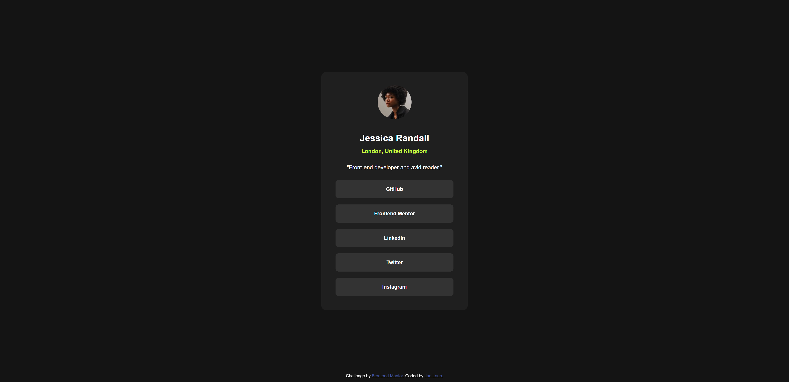

# Frontend Mentor - Social links profile solution

This is a solution to the [Social links profile challenge on Frontend Mentor](https://www.frontendmentor.io/challenges/social-links-profile-UG32l9m6dQ). Frontend Mentor challenges help you improve your coding skills by building realistic projects. 

## Table of contents

- [Overview](#overview)
  - [The challenge](#the-challenge)
  - [Screenshot](#screenshot)
  - [Links](#links)
- [My process](#my-process)
  - [Built with](#built-with)
  - [What I learned](#what-i-learned)
  - [Continued development](#continued-development)
- [Author](#author)

## Overview

### The challenge

Users should be able to:

- See hover and focus states for all interactive elements on the page

### Screenshot



### Links

- Solution URL: [Add solution URL here](https://your-solution-url.com)
- Live Site URL: [https://pokerlo442.github.io/social-link-profile/](https://your-live-site-url.com)

## My process

### Built with

- Semantic HTML5 markup
- CSS custom properties
- Flexbox

### What I learned

In the challenge I learned that you can change cursor designs via a URL.   

```css
.btn:hover, .btn:focus, .btn:active{
  cursor: url(./assets/images/icons8-cursor-24.png), auto;  
}
```

### Continued development

I want to continue working on compressing css with class containers so that my code can be processed faster and is easier and faster to read. 

## Author

- Frontend Mentor - [@yourusername](https://www.frontendmentor.io/profile/yourusername)
